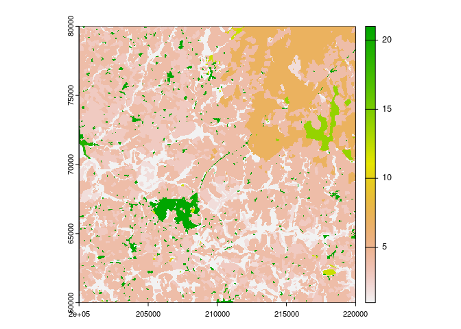
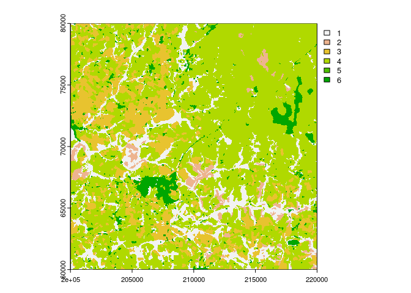
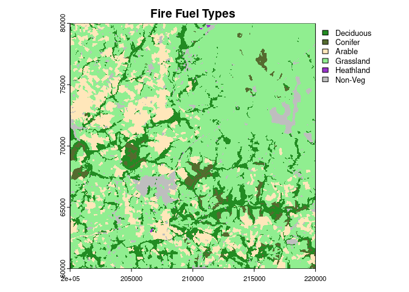
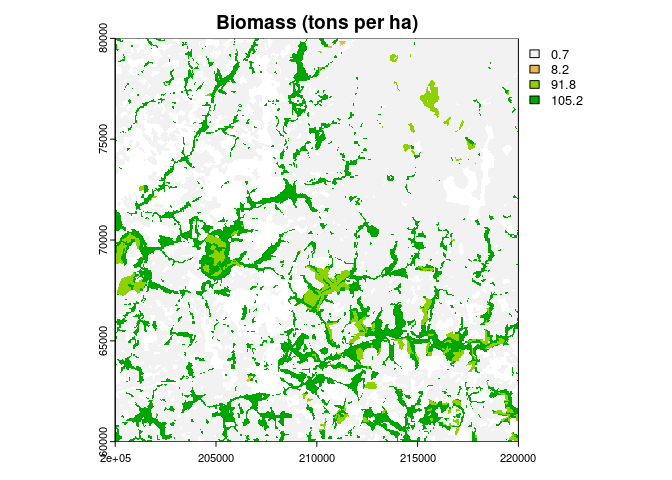
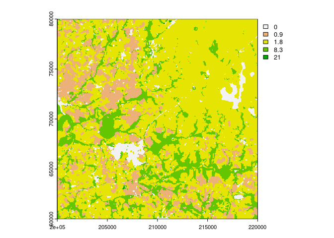
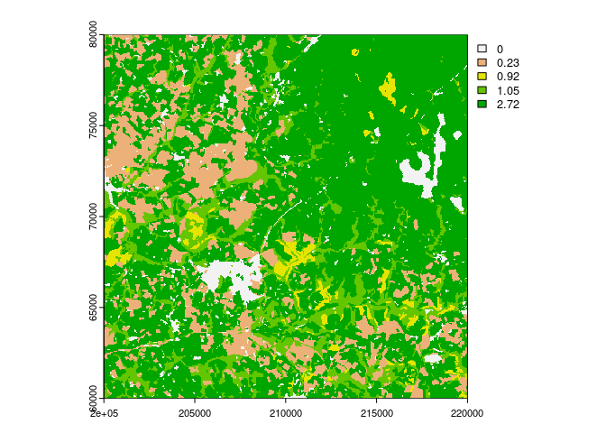

# Cornwall Fire Model
James Millington

``` r
library(terra)
library(tidyverse)
library(googlesheets4)
```

## Introduction

This document presents code and to implement the McArthur Fire model for
a region of Cornwall, UK, parameterised using field data collected by
King’s College London students in the Dept. of Geography.

## Model Inputs

Equations for the McArthur fire model we will use come from [Noble *et
al.* (1980)](https://doi.org/10.1111/j.1442-9993.1980.tb01243.x). To
apply the model to a particular location and time we need to provide
various numeric inputs.

In the field, students collected data to help estimate key variables for
McArthur’s model for different land cover types represented in the UK
CEH Land Cover Map:

- degree of curing, *C*, in %

- fuel load, *W*, in tons per hectare

By combining these variables with climate variables and the UK CEH Land
Cover Map we can estimate fire danger and rate of spread across Cornwall
and for different climate scenarios.

Summaries of the data collected by the six groups of students are shown
in the Summary tab of [the Google spreadsheet used to record the
data](https://docs.google.com/spreadsheets/d/1HReAFVljlUpjqmHOGYqvDZcUn9lkkPPRQ9ebb5BkQso/edit?usp=sharing).
In turn, these summaries depend on summary equations in each of the data
sheets (see rows at the bottom of input data). Finally, calculations
from the combined student field measurements are made in cells A26:E30
(shaded blue) on the Summary tab. Several of these calculations are
based on the information presented in [Pasalodos-Tato *et al.*
(2015)](http://doi.org/10.1007/s10342-015-0870-6).

We can read these estimated values for *C* and *W* for the different
land cover types directly our model code here:

``` r
sheet_data <-range_read(ss="https://docs.google.com/spreadsheets/d/1HReAFVljlUpjqmHOGYqvDZcUn9lkkPPRQ9ebb5BkQso/edit#gid=937321199",
                        sheet="Summary",
                        range="A26:E30")
sheet_data
```

    # A tibble: 4 × 5
      `Land Cover`  Grass Heath   Decid Conif
      <chr>         <dbl> <dbl>   <dbl> <dbl>
    1 Curing       29.1   32.6   NA      NA  
    2 W-ground      0.716  1.91   0.667   0  
    3 W-trees       0      6.28 105.     91.8
    4 W-total       0.716  8.19 105.     91.8

## Model Application

``` r
fpath <- "/home/james/OneDrive/Teaching/2022-23/undergrad/fieldwork/cornwall/data/lcm-2020-25m_tiled_4639069/sx/sx06.tif"
sx06 <- rast(fpath, lyrs=1)
plot(sx06)
```



The colours and their corresponding values in the map above correspond
to the UK CEH Land Cover classification.

We shall re-classify these

| Fire Fuel Type | Fire Fuel Type ID | Original CEH Classes |
|----------------|-------------------|----------------------|
| Deciduous      | 1                 | 1                    |
| Conifer        | 2                 | 2                    |
| Arable         | 3                 | 3                    |
| Grassland      | 4                 | 4-7                  |
| Heathland      | 5                 | 9-10                 |
| Non-Veg        | 6                 | 8, 11-21             |

Re-classification of land cover for fire model

``` r
decid <- c(1,1,1)
conif <- c(2,2,2)
arable <- c(3,3,3)
grass <- c(4,7,4)
nonVeg <- c(8,8,6)
heath <- c(9,10,5)
nonVeg2 <- c(11,21,6)

FMC <- rbind(decid, conif, arable, grass, nonVeg, heath, nonVeg2)

fuelType <- classify(sx06, rcl=FMC, right=NA)

plot(fuelType, main="Fire Fuel Types")
```



Now we create raster maps for the curing and biomass inputs, applying
the estimates from the field to each of our land cover types. First, the
curing input (from % dead vegetation) for Grassland and Heathland.

``` r
curing <- fuelType
curing[curing==1]<-NA
curing[curing==2]<-NA
curing[curing==3]<-NA
curing[curing==4]<-as.numeric(sheet_data[1,2])
curing[curing==5]<-as.numeric(sheet_data[1,3])
curing[curing==6]<-NA
plot(curing, main="Curing (% dead veg)")
```



Next biomass for Deciduous forest , Confier forest, Grassland and
Heathland.

``` r
biomass <- fuelType
biomass[biomass==1]<-as.numeric(sheet_data[4,4])
biomass[biomass==2]<-as.numeric(sheet_data[4,5])
biomass[biomass==3]<-NA
biomass[biomass==4]<-as.numeric(sheet_data[4,2])
biomass[biomass==5]<-as.numeric(sheet_data[4,3])
biomass[biomass==6]<-NA
plot(biomass, main="Biomass (tons per ha)")
```



We also need to provide climate inputs - if we assume climate is uniform
across the study region we don’t need to make rasters but can just
create individual variables.

``` r
temperature <- 20  #degrees C
humidity <- 50     #%
wind <- 10         #km/hr
KDBI <- 400     #KDBI
daysRain <- 1   #days since rain
pptn <- 10      #last rain in mm
  
drought <- 0.191*(KDBI+104)*(daysRain+1)^1.5/(3.52*(daysRain+1)^1.5+pptn-1)
```

Now we can calculate Fire Danger using the McArthur grassland fire
danger model for Grassland and Heathland fuel types (land covers) using
their respective curing and biomass values, and the forest fire danger
model for the Deciduous and Conifer types for their curing and biomass
values.

``` r
GrassM <- (((97.7+4.06*humidity)/(temperature+6)-0.00854*humidity))*((100-curing)/100)
GrassFDM <- 3.35*biomass*exp(-0.0897*GrassM+0.0403*wind)
ForestFDM <- 1.25*drought*exp((temperature-humidity)/30+0.0234*wind)


FDM <- GrassFDM
FDM[fuelType==1]<-ForestFDM    #deciduous
FDM[fuelType==2]<-ForestFDM    #conifer
FDM[fuelType==3]<-max(GrassFDM[fuelType==4])/2   #half grassland danger 
FDM[fuelType==6]<-0    #non-veg

plot(FDM)
```



Rate of Spread

``` r
RoS <- FDM

forestMulti<-max(FDM[fuelType==1])*0.0012

grassRoS<-max(FDM[fuelType==4]*0.13)
heathRoS<-max(FDM[fuelType==5]*0.13)

RoS[fuelType==1]<-biomass*forestMulti
RoS[fuelType==2]<-biomass*forestMulti
RoS[fuelType==3]<-grassRoS
RoS[fuelType==4]<-heathRoS
RoS[fuelType==5]<-grassRoS
RoS[fuelType==6]<-0

plot(RoS)
```



## References

Pasalodos-Tato, M., Ruiz-Peinado, R., Del Río, M., & Montero, G. (2015).
Shrub biomass accumulation and growth rate models to quantify carbon
stocks and fluxes for the Mediterranean region. *European Journal of
Forest Research*, *134*, 537-553.
<https://doi.org/10.1007/s10342-015-0870-6>

Noble, I. R., Gill, A. M., & Bary, G. A. V. (1980). McArthur’s
fire‐danger meters expressed as equations. *Australian Journal of
Ecology*, *5*(2), 201-203.
<https://doi.org/10.1111/j.1442-9993.1980.tb01243.x>
